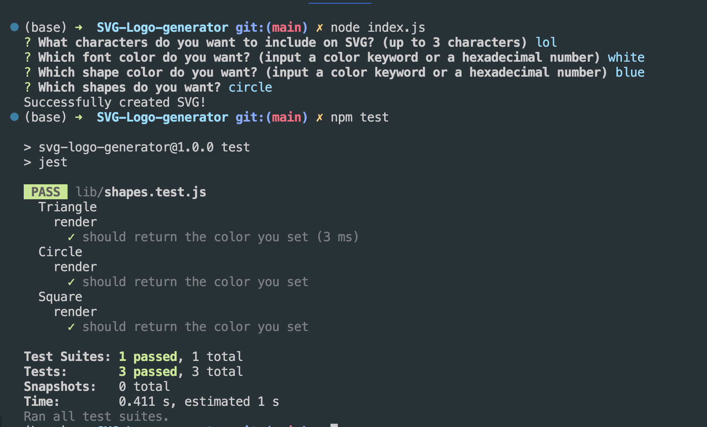

# SVG-Logo-generator

## Description

The SVG Logo Generator is a command-line application that allows users to generate custom SVG logos. Users can select a color and shape, provide text for the logo, and save the generated SVG to a ".svg" file.

## Feature

- Supports three basic shapes: Circle, Triangle, and Square.
- Customizable text content, font color, and shape color.
- Generates SVG code based on user input.
- Saves the generated SVG logo to a file.

## Installtion and Usage

1. Clone this repository to your local machine using the following command:
```
git clone https://github.com/Hiroro1989/SVG-Logo-generator.git
```

2. Navigate to the project directory

3. npm install

4. node index.js

[Demo Video](https://drive.google.com/file/d/1eTJCFmDlx9V9eNRNgVj3IDOAotu4CBzp/view)



## Development

To run the tests using Jest:
```
npm test
```

